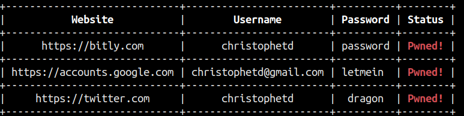

# firepwned

Firepwned is a tool that checks if your Firefox saved passwords have been involved in a known data leak using the [Have I Been Pwned API](https://haveibeenpwned.com/Passwords).



Features:
- **Does not send any of your password or password hash to any third-party service, including Have I Been Pwned** (see [How It Works](#how-it-works) below).
- Supports Firefox profiles encrypted with a master password.
- Uses multiple threads for efficiency.

## Installation

```
$ git clone https://github.com/christophetd/firepwned.git
$ cd firepwned
$ pip install -r requirements.txt
```

## Usage

```
$ python firepwned.py
```

- To specify a path to a Firefox profile directory, use the `--profile` option (by default: `~/.mozilla/firefox/*.default`)
- To adjust the number of threads used to make requests to the Have I Been Pwned API, use the `--threads` option (by default: 10)

## Docker image

You can also use the `christophetd/firepwned` image. It is based on Alpine and is very lightweight (~20 MB). 

When running the container, you need to mount the directory of your Firefox profile to `/profile` in the container.

```
$ docker run --rm -it \
    --volume $(ls -d ~/.mozilla/firefox/*.default):/profile \
    christophetd/firepwned
```

Any additional argument you add to the command will be passed to the script, e.g.

```
$ docker run --rm -it -v ~/.mozilla/firefox/*.default:/profile christophetd/firepwned --threads 20
```

## How it works

The Have I Been Pwned API supports checking if a password has been leaked without providing the password itself, or even a hash. The way it works is you provide the API with the first 5 characters of the SHA1 hash of the password to check. The API then returns the list of all leaked hashes starting with this prefix, and the script can check locally if one of the hashes matches the password. More information: https://www.troyhunt.com/ive-just-launched-pwned-passwords-version-2/

## Compatibility

Python 3 only. Should theoretically work on any OS supporting Python if provided with the directory of a valid Firefox profile, e.g. on Windows 7:

```
> python firepwned.py --profile "C:\Users\Christophe\AppData\Roaming\Mozilla\Firefox\Profiles\xxxxxx.default"
```

## Acknowledgments

The code to read the saved passwords from Firefox is taken from [firefox_decrypt](https://github.com/unode/firefox_decrypt), written by Renato Alves and under the GPL-3.0 license.

## Unit tests

```
$ python -m unittest discover test
```

